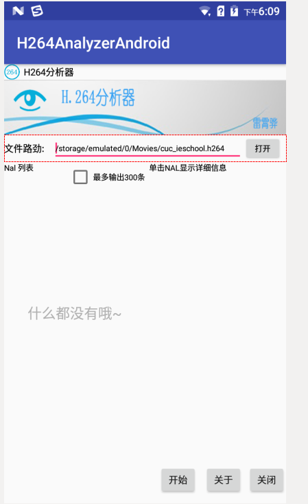

本项目是基于开源工程h264bitstream在Android平台上开发的H.264分析器，可以简单分析本机上的h264碼流文件

软件运行后，首先打开一个码流文件。然后单击“开始”，可以解析出一系列NAL，在左侧的列表中显示出来。列表中显示出了每一个NAL的nal_reference_idc、nal_type等信息，
不同种类的NAL被标记成了不同的颜色。单击任意一个NAL，可以在右边显示出其详细信息

编译 \
   进入jni目录 \
   执行 ndk-build

运行 \
   直接用AS运行即可

软件运行界面如下

 ;
 
点击开始按钮，在文件浏览器上选择要分析的h264碼流文件,选择的文件路径会在软件界面编辑框上显示出来，界面如下
;

